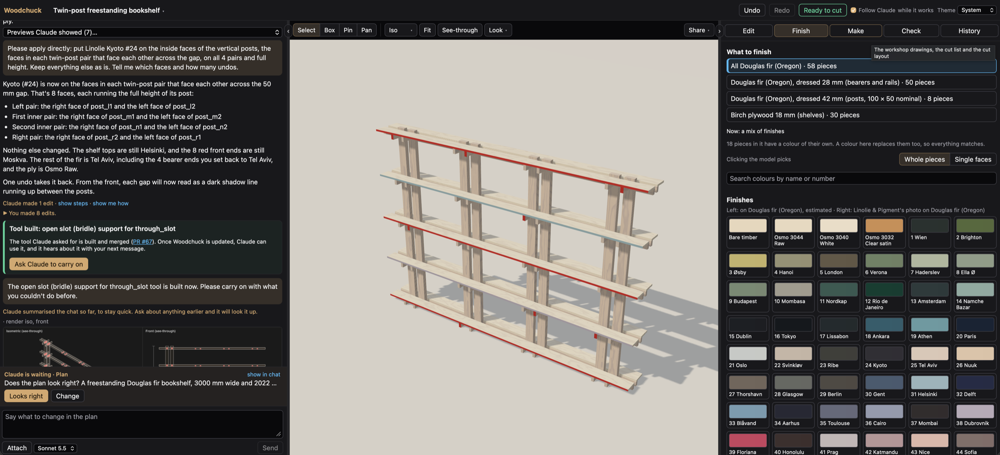

# Woodchuck

Woodchuck is a furniture planner you talk to. You describe a piece of
wooden furniture, Claude builds it with a fixed set of woodworking tools,
and you both edit the same 3D model. A picture of a piece isn't enough to
build it from, so every size is worked out from the design, checked after
every change and set out on a cut list and workshop drawings you can trust
before you cut timber. It runs on your own computer and keeps your designs
there.



## Get it running

You need these.

- [Node](https://nodejs.org) 24 or newer, which comes with npm.
- [git](https://git-scm.com), which keeps every design's version history.
- macOS or Linux. Windows isn't covered, since `start.sh` is a bash script.
- An [Anthropic API key](https://console.anthropic.com) for the chat with
  Claude. Without one, everything except the chat still works.
- An [OpenAI API key](https://platform.openai.com/api-keys) if you want the
  AI blend in photo mode. It's optional, and each blend costs money.
- Google Chrome or Chromium, only if another app will ask Woodchuck for
  pictures of a design.

Install the packages and make your settings file.

```bash
git clone https://github.com/shawn-durrani/woodchuck.git
cd woodchuck
npm ci
cp .env.example .env
```

Open `.env` and put your Anthropic key after `ANTHROPIC_API_KEY=`. Git
ignores `.env`, so your keys stay out of the repo. Then start it.

```bash
./start.sh
```

Open http://127.0.0.1:8905. The first start builds the web app, which takes
a minute. After that `start.sh` only reinstalls or rebuilds when something
changed. Woodchuck answers on this computer only, and your designs are kept
in `data/`, which git ignores. [docs/CONFIG.md](docs/CONFIG.md) lists every
other setting, such as the port.

To work on Woodchuck itself, run `npm run dev` and open
http://127.0.0.1:8906. That reloads the page as you change the code.

### Turn on GitHub, if you want it

Woodchuck can file a missing tool as a GitHub issue and share a part you
approve as a pull request. It stays off until you name a repository you can
write to, such as your own fork. It works through the
[GitHub CLI](https://cli.github.com), so install that and sign in.

```bash
gh auth login
```

Then add the repository to `.env`, written owner/name, and restart.

```
WOODCHUCK_REPO=you/woodchuck
```

The issues and pull requests it opens are public whenever that repository
is. A missing tool's issue quotes your design only when you tick the box
for it.

### Keep it running, if you want

On macOS, one command hands Woodchuck to launchd, which starts it at login
and restarts it if it stops. Run it from the checkout.

```bash
service/install-service.sh
```

On Linux, run `./start.sh` under your own service manager.
[docs/OPERATIONS.md](docs/OPERATIONS.md) covers both, with restarts and
logs.

### Updating

Pull the new code, then restart Woodchuck.

```bash
git pull
```

Run `./start.sh` again, or restart the service with
`launchctl kickstart -k gui/$(id -u)/dev.woodchuck.server`. It reinstalls
packages and rebuilds the web app when they've changed. A restart in the
middle of Claude's turn cuts that turn off, so wait until the chat is
quiet. An open window reloads itself onto the new version once nothing
would be lost.

## What it does

- **Claude designs with you.** It builds a first draft straight away, so
  you watch it take shape, then pins its plan beside the model. While it
  works, the screen follows it through the same tabs and controls you'd
  use, and you can keep talking to it and editing.
- **It never fakes a design.** Claude works with panels, joints, arrays,
  hardware and rules, and never writes code. When those can't express
  something, it stops and writes up the tool it needs.
- **Every size shows its working.** A dado lengthens the shelf it holds,
  and the cut list says so. Change one size and everything that depends on
  it moves.
- **Checks run after every change.** They catch overlaps, parts nothing
  holds up, joints out of proportion, parts too big for your stock and the
  rules you set. A design is ready to cut only when nothing is in error.
- **Joints come from a library of fourteen,** from butt joints and pocket
  screws to Dominos, mortise and tenons, half laps, box joints and through
  slots.
  A drawer's bottom sits in grooves and its corners are rabbeted.
  Each says when it suits, which tools cut it and its usual proportions,
  and a worked example on two sample boards shows how it goes together.
- **Workshop drawings print at true scale.** They come as a PDF on A4 or
  A3, with the main views, a drawing of each part and the cut, drilling and
  hardware lists. Every size on them matches the cut list to 0.1 mm.
- **Cut layout buys the least timber.** It places every part on the sheets
  and lengths you buy, a saw kerf apart, and lists the offcuts worth
  keeping.
- **Finishes look like timber.** Pick a species and a Linolie Satin Wood
  Oil or Osmo Polyx-Oil colour for a material, a part or a single face, and
  the Finished look draws its grain under daylight, evening or workshop
  light.
- **Your room, with the piece in it.** Photo places the design in a photo
  of your room at its true size. The optional AI blend relights the piece
  to match, and labels the result as not to scale.
- **Point at what you mean.** Click parts, drag a box or drop numbered pins
  to tell Claude what to change. A change it suggests is drawn on the model
  as a ghost until you apply it.
- **Real parts, researched.** Name a drawer slide or a hinge, or paste a
  link, and Claude researches it on the web and proposes a part card with
  its sources. Once you approve it, every design can use it.
- **Nothing is lost.** Every change is one undo, whether you or Claude made
  it, and a version in a git history on your computer.
- **From your phone or another chat.** Put Woodchuck on your own
  [tailnet](https://tailscale.com/kb/1136/tailnet) behind an owner lock to
  use it from a phone, as [docs/REMOTE_ACCESS.md](docs/REMOTE_ACCESS.md)
  says. It's also an [MCP](https://modelcontextprotocol.io) server, so
  another chat app can work on the open design, as
  [docs/MCP.md](docs/MCP.md) says.

The record console, in the design menu, is a worked example and the
acceptance test in [docs/TESTING.md](docs/TESTING.md). Its LP check fails
until you change its drawer slides, and the example's card says why.

## Your workshop

Claude plans around your workshop. Your workshop, in the design menu on the
design's name, holds the tools you have, your usual finishes, the language
Claude writes in and the country it searches for parts in. Claude reads
them at the start of each message, and changing them never changes a
design.

A new install starts with a standard home workshop. That's a table saw or
track saw, a router, a drill/driver, a pocket-hole jig, chisels and clamps,
with Linolie Satin Wood Oil for colour and Osmo Polyx-Oil Raw 3044 on birch
plywood. Claude starts out writing in Australian English and searching for
parts in Australia. Change any of them to suit you, and leave the country
empty to search anywhere.

## Documentation

[docs/README.md](docs/README.md) lists every document by what you're trying
to do.

- [ARCHITECTURE.md](ARCHITECTURE.md) holds the settled design decisions and
  the reasons for them.
- [docs/CONFIG.md](docs/CONFIG.md) lists every setting and its default.
- [docs/OPERATIONS.md](docs/OPERATIONS.md) covers keeping it running,
  restarts, logs and your designs.
- [docs/REMOTE_ACCESS.md](docs/REMOTE_ACCESS.md) puts it on your tailnet,
  behind a lock.
- [docs/MCP.md](docs/MCP.md) connects another chat app.
- [docs/TESTING.md](docs/TESTING.md) says what the tests hold.
- [CONTRIBUTING.md](CONTRIBUTING.md) says how to send a change.
- [SECURITY.md](SECURITY.md) says who can reach the app, what leaves your
  computer and how to report a problem privately.

## Licence

[MIT](LICENSE).
