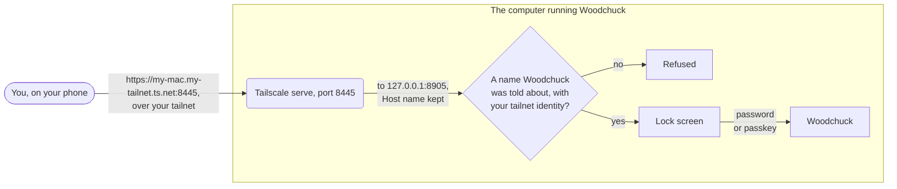

# Using Woodchuck from your phone

You can drive Woodchuck from a phone, a tablet or another computer, and it
never goes on the internet. Out of the box it answers only on the computer
it runs on. The steps here put it on your own tailnet, behind an owner lock,
in about ten minutes.

You need [Tailscale](https://tailscale.com), which makes a private network
between your own devices. That network is called a
[tailnet](https://tailscale.com/kb/1136/tailnet), and only devices signed
in to your account are on it. Its
[`tailscale serve`](https://tailscale.com/kb/1242/tailscale-serve) command
gives Woodchuck an HTTPS address that only your tailnet can reach. Woodchuck
itself stays on `127.0.0.1` throughout, and Tailscale passes each request on
to it.

## What you're agreeing to

Once Woodchuck is on your tailnet, the tailnet is its outer fence. Any
device on it can reach the lock screen. Behind that screen are your
designs, your Anthropic and OpenAI credit, and the GitHub issues and pull
requests the app opens for you. The lock screen asks for your owner
password, or a [passkey](https://passkeys.dev/docs/intro/what-are-passkeys/)
once you've added one.

- Only your own devices go on that tailnet. If you wouldn't hand someone
  your unlocked laptop, don't add their device.
- Use `tailscale serve`, never `tailscale funnel`.
  [Funnel](https://tailscale.com/kb/1223/funnel) is the public version of
  the same command, and it would put Woodchuck on the open internet.
- On the computer that runs it, Woodchuck stays open with no sign-in. The
  MCP server, your own scripts and your browser there keep working as they
  are.

Woodchuck checks too. Every few minutes it asks Tailscale whether Funnel is
on for its port, and while it is, it serves nothing but a page that says
so. Turn Funnel off with `tailscale funnel reset`, and Woodchuck comes back
by itself at the next check. Between checks there's a backstop. Tailscale
names your tailnet user on every request it passes on, and a request on the
tailnet name without that name is refused before the lock screen.

## Turn it on

The steps use the
[`tailscale` command](https://tailscale.com/kb/1080/cli). On Linux it's on
your `PATH` once Tailscale is installed. On a Mac it lives inside the
Tailscale app and isn't on your `PATH`, so name it in `.env` for the serve
script and the Funnel check.

```
WOODCHUCK_TAILSCALE_BIN=/Applications/Tailscale.app/Contents/MacOS/Tailscale
```

1. Install Tailscale on the computer that runs Woodchuck and on your phone,
   and sign in to the same account on both. The free personal plan is
   enough.

2. Tell Woodchuck the computer's tailnet name. It ends in `.ts.net`, and the
   [Machines page](https://login.tailscale.com/admin/machines) of the
   Tailscale admin console lists it. Add it to `.env`, with your own name
   in it.

   ```
   WOODCHUCK_TRUSTED_HOSTS=my-mac.my-tailnet.ts.net
   ```

   Without it, Woodchuck refuses everything that arrives under that name.

3. Serve Woodchuck on your tailnet. Run the script once, or add
   `WOODCHUCK_TAILSCALE_SERVE=1` to `.env` so every start runs it.

   ```bash
   scripts/tailscale-serve.sh
   ```

   It serves Woodchuck on its own HTTPS port, 8445, and prints the address.
   It never runs Funnel, and it refuses to set anything up while Funnel is
   on. Then restart Woodchuck, so it reads the new settings. Stop
   `./start.sh` and run it again, or restart the service as
   [OPERATIONS.md](OPERATIONS.md) says. With the macOS agent, that's this
   command.

   ```bash
   launchctl kickstart -k gui/$(id -u)/dev.woodchuck.server
   ```

4. Check that it's tailnet only. The line with your address must say
   "tailnet only".

   ```bash
   scripts/tailscale-serve.sh --status
   ```

5. On your phone, open the address.

   ```
   https://my-mac.my-tailnet.ts.net:8445
   ```

6. Set the owner password. The lock screen asks for the recovery secret
   first, to prove it's you. That's `WOODCHUCK_RECOVERY_SECRET` in `.env`
   if you set one. If you didn't, it's the random secret in Woodchuck's
   log, which it prints on each start until a password is set. With the
   macOS agent the log is `data/service.log`. Choose a password of at least eight characters.

7. Add a passkey on each device. Once you're in, open Passkeys in the top
   bar and click "Add a passkey on this device". Next time the lock screen
   offers Face ID or Touch ID first. A passkey belongs to the address it
   was made at, so add one on each device you use.

Your password stays as the fallback, and removing a passkey can't lock you
out. If you forget the password, the lock screen's reset link sets a new
one with the recovery secret, and every signed-in browser is signed out.

## Where a request goes

Tailscale serve takes each request at the HTTPS address and passes it to
Woodchuck at `127.0.0.1`. The request still carries the name it was sent
to, in its
[Host](https://developer.mozilla.org/en-US/docs/Web/HTTP/Reference/Headers/Host)
header. Woodchuck checks it on every request, and refuses any name it
wasn't told about. A hostile website can point its own name at
`127.0.0.1`, and the Host check is what turns it away.



The live-updates connection meets the same checks, and the page's own
address has to match. [SECURITY.md](../SECURITY.md#tailnet-only-if-you-widen-it)
has the detail.

## Turn it off

Take `WOODCHUCK_TAILSCALE_SERVE` and `WOODCHUCK_TRUSTED_HOSTS` out of
`.env`, and restart Woodchuck. It then refuses the tailnet name. To take
the route down in Tailscale as well, see what's served with
`tailscale serve status` and remove it as
[Tailscale's serve guide](https://tailscale.com/kb/1242/tailscale-serve)
says. Your password and passkeys stay in `data/lock.json` for next time.
